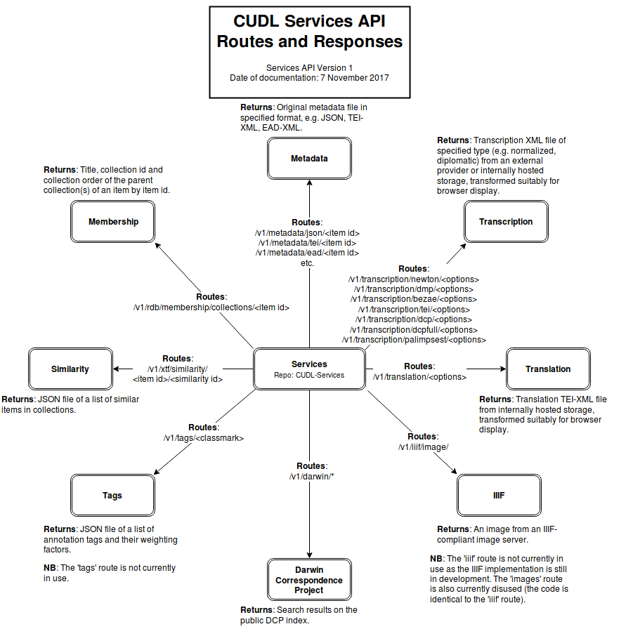
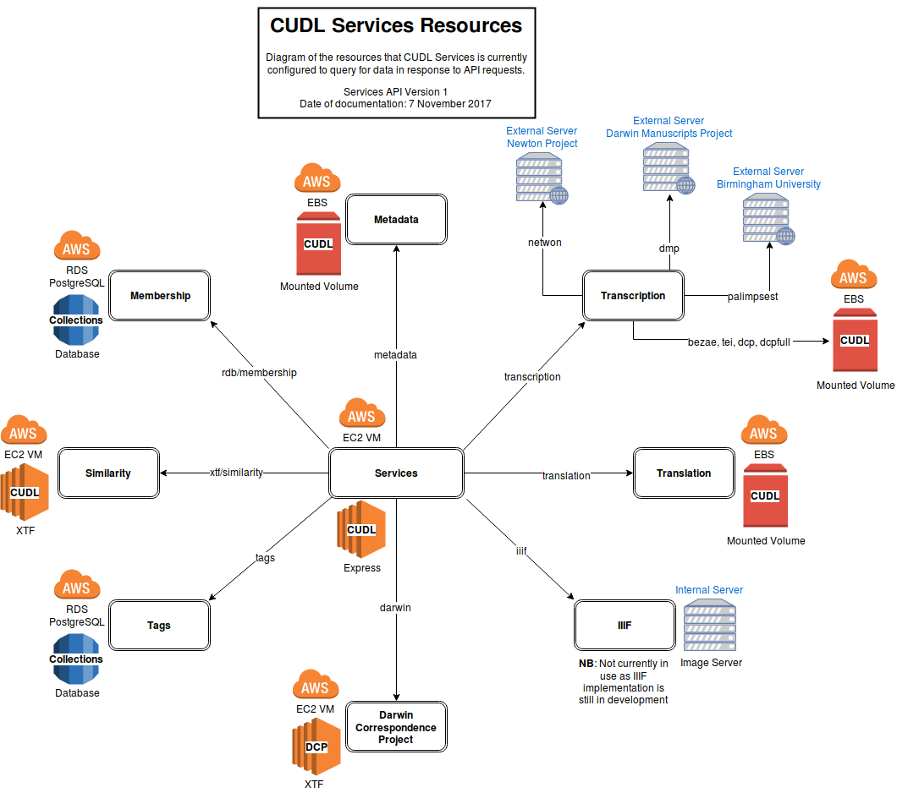

# CUDL Services

CUDL Services is an [Express](https://expressjs.com/)-powered JavaScript middleware application that exposes an API 
for accessing various CUDL-related resources.

CUDL Services routes requests made for data by the CUDL Viewer to a PostgreSQL database, metadata document stores 
(hosted by us and externally hosted), XTF search instance and image server, and handles the responses back to the 
viewer. It also handles one route for the Darwin Correspondence Project that is unrelated to the CUDL Viewer.

The API is publicly accessible and (for the most part) requires no authentication, but is designed to be used primarily
 by the CUDL viewer.
 
Currently, there are 3 independent instances of CUDL Services in deployment (dev, staging, live).

## Documentation

The main source of documentation for CUDL Services is this [`README.md`](README.md) 
file. The diagrams are created using the  open-source, freely available editor [draw.io](https://www.draw.io/) 
and stored in [`docs/diagrams/`](docs/diagrams/) 
(compressed XML) with PNG versions to insert here in [`docs/images/`](docs/images/). 
When making changes to the API, please update the documentation for a gold star :star:

## Configuration

The main configuration file is [`default.js`](config/default.js),
 which configures:

* Paths to mounted volumes that store metadata
* PostgreSQL configuration
* Image server host
* Darwin XTF host

The external hosts responsible for returning transcription data for the Newton Project, Darwin Manuscripts Project 
and Quranic Palimpsests are configured within the [`transcription.js`](routes/transcription.js) 
route file.

(NB: the instance of CUDL Services the Viewer uses is configured in CUDL-Viewer `cudl-global.properties` file.)

## Routes and Responses

The routes in use are defined in [`app.js`](app.js#app.js-81):

### Darwin Correspondence Project (DCP)
Route: `/v1/darwin/`

Definition: [`routes/darwin.js`](routes/darwin.js)

Returns: Search results on the public DCP XTF index.

Usage: By the Drupal public DCP portal at [www.darwinproject.ac.uk](www.darwinproject.ac.uk).

**NB**: This route is secured by an authentication token so that only the DCP Drupal instance can use it. For more on 
the Darwin Correspondence Project see [DCP on the CUDL Wiki](https://wiki.cam.ac.uk/cudl-docs/Darwin_Correspondence_Project).

### IIIF
Route: `/v1/iiif/`

Definition: [`routes/iiif.js`](routes/iiif.js)

Returns: An image from an IIIF-compliant image server.

Example Usage: When displaying collection item images in the CUDL Viewer.

**NB:** The 'iiif' route is not currently in use as the IIIF implementation is still in development.

### Images
Route: `/v1/images/`

Definition: [`routes/images.js`](routes/images.js)

**NB:** The 'images' route is currently disused.

### Membership
Route: `/v1/rdb/membership/`

Definition: [`routes/membership.js`](routes/membership.js)

Returns: Title, collection id and collection order of the parent collection(s) of an item by item id.

Example Usage: By the CUDL and DCU XTF search instances.

### Metadata
Route: `/v1/metadata/`

Definition: [`routes/metadata.js`](routes/metadata.js)

Returns: Original metadata file in specified format, e.g. JSON, TEI-XML, EAD-XML.

Example Usage: When the 'Download metadata' button in the CUDL Viewer is clicked.

### Similarity
Route: `/v1/xtf/similarity/`

Definition: [`routes/similarity.js`](routes/similarity.js)

Returns: JSON file of a list of similar items in collections.

Example Usage: When loading the content for the 'Similar items' tab in the CUDL Viewer.

### Genizah Tags
Route: `/v1/tags/`

Definition: [`routes/tags.js`](routes/tags.js)

Returns: JSON file of a list of annotation tags and their weighting factors.

**NB**: The 'tags' route is not currently in use. CUDL Viewer (that is, CUDL-Viewer-Tagging-UI) uses routes defined in 
the CUDL-Viewer code instead (see [CrowdsourcingController](https://bitbucket.org/CUDL/cudl-genizahtagging-server/src/HEAD/src/main/java/ulcambridge/foundations/viewer/crowdsourcing/CrowdsourcingController.java?at=master&fileviewer=file-view-default)). 
For more on Genizah Annotation see [Genizah Annotation on the CUDL Wiki](https://wiki.cam.ac.uk/cudl-docs/Genizah_Annotation).

### Transcription
Route: `/v1/transcription/`

Definition: [`routes/transcription.js`](routes/transcription.js)

Returns: Transcription XML file of specified type (e.g. normalized, diplomatic) from internally hosted storage or an 
external provider, transformed suitably for browser display.

Example Usage: When loading the content for the two 'Transcription' tabs in the CUDL Viewer.

### Translation
Route: `/v1/translation/`

Definition: [`routes/translation.js`](routes/translation.js)

Returns: Translation TEI-XML file from internally hosted storage, transformed suitably for browser display.

Example Usage: When loading the content for the 'Translation' tab in the CUDL Viewer.

## Resources in Deployment

CUDL Services sends requests to a variety of resources in its current deployments.

There are 3 VMs (dev, staging, live) that each run independently the full suite of CUDL Services, CUDL Viewer and XTF 
instances, each with a separate mounted EBS volume and separate RDS PostgreSQL database.

In addition, there is 1 VM running for the Darwin Correspondence Project XTF instance, 2 bare metal image servers and 3 
servers external to CUDL provided by the originating projects.

